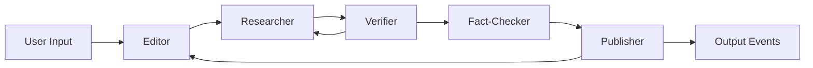

# LocAIted Agent Architecture

**Last Updated:** August 21, 2025  
**Version:** 0.5.0 (with Verifier agent)

## Overview

LocAIted uses a multi-agent architecture where each agent has a specific responsibility in the event discovery pipeline. Agents communicate through a shared state managed by LangGraph workflow.

## Agent Responsibilities

### 1. Editor Agent (`editor.py`)

**Purpose:** Transform user input into actionable search profile for other agents

**Responsibilities:**
- Parse user query and extract interests
- Generate search keywords and domains
- Create researcher guidance from user preferences
- Handle retry feedback from Publisher
- Build refined profiles based on validation failures

**Does NOT:**
- Generate event ideas
- Search the web
- Verify events
- Extract structured data

**Key Methods:**
- `process()` - Main entry point
- `_generate_profile()` - Creates search profile from input
- `_handle_retry()` - Processes Publisher feedback

**Input State:**
```python
{
    "user_input": str | Dict,
    "retry_feedback": str (optional)
}
```

**Output State:**
```python
{
    "profile": {
        "interests": List[str],
        "location": str,
        "time_frame": str,
        "search_keywords": List[str],
        "researcher_guidance": str
    }
}
```

---

### 2. Researcher Agent (`researcher.py`)

**Purpose:** Generate high-quality event leads based on profile

**Responsibilities:**
- Generate initial event ideas (50 events)
- Perform reality check (filter hallucinated venues/orgs)
- Handle Verifier feedback and refine events
- Expand generic events into specific sub-events
- Build search queries for Fact-Checker

**Does NOT:**
- Validate date/location specificity (Verifier's job)
- Search web for evidence (Fact-Checker's job)
- Extract structured events from evidence (Publisher's job)

**Key Methods:**
- `process()` - Main orchestrator
- `_verify_event_reality()` - Check if venues/orgs are real
- `_expand_generic_events()` - Convert generic to specific
- `_build_search_query()` - Create Tavily search queries
- `_handle_verifier_feedback()` - Process Verifier results

**Validation Methods Being Moved to Verifier:**
- `_validate_and_enhance_leads()` - Entire validation logic
- Date range checking logic
- Specificity categorization

**Input State:**
```python
{
    "profile": Dict,
    "location": str,
    "time_frame": str,
    "verification_results": List[Dict] (optional, from Verifier)
}
```

**Output State:**
```python
{
    "events_to_verify": List[Dict] (first pass),
    "leads": List[Dict] (after verification)
}
```

---

### 3. Verifier Agent (`verifier.py`) - NEW

**Purpose:** Validate event specificity and temporality

**Responsibilities:**
- Check if events have specific date AND location
- Determine if events are future, past, or ongoing
- Cache verification decisions
- Support both LLM and LlamaIndex implementations

**Does NOT:**
- Generate new events
- Check if venues exist (that's reality check)
- Search web
- Filter events (only classify)
- Provide improvement suggestions

**Key Methods:**
- `process()` - Main entry point
- `verify_event()` - Verify single event
- `verify_batch()` - Verify multiple events

**Input State:**
```python
{
    "events_to_verify": List[Dict]
}
```

**Output State:**
```python
{
    "verification_results": List[Dict],
    "verified_events": List[Dict],  # Passed both checks
    "rejected_events": List[Dict],  # Failed one or both
    "needs_more_events": bool  # True if <15 passed
}
```

**Verification Result Structure:**
```python
{
    "event": Dict,
    "is_specific": bool,
    "specificity_details": {
        "has_date": bool,
        "has_location": bool,
        "has_time": bool  # Bonus
    },
    "temporality": "FUTURE" | "PAST" | "ONGOING" | "UNCLEAR",
    "confidence": float,
    "should_keep": bool
}
```

---

### 4. Fact-Checker Agent (`fact_checker.py`)

**Purpose:** Find web evidence for event leads

**Responsibilities:**
- Search Tavily API for each lead
- Cache search results aggressively
- Extract relevant snippets
- Track API costs
- Batch searches efficiently

**Does NOT:**
- Generate events
- Validate events
- Extract structured event data
- Make quality decisions

**Key Methods:**
- `process()` - Main entry point
- `_search_events()` - Batch Tavily searches
- `_extract_evidence()` - Pull relevant snippets

**Input State:**
```python
{
    "leads": List[Dict]
}
```

**Output State:**
```python
{
    "evidence": List[Dict],
    "fact_checker_metrics": {
        "searches_performed": int,
        "cache_hits": int,
        "api_cost": float
    }
}
```

---

### 5. Publisher Agent (`publisher.py`)

**Purpose:** Extract and curate final events from evidence

**Responsibilities:**
- Extract structured events from web evidence
- Perform second reality check using evidence
- Deduplicate similar events
- Score events for photographic value
- Make gate decision (APPROVE/RETRY/REJECT)

**Does NOT:**
- Generate new event ideas
- Search web
- Validate specificity (trusts Verifier)

**Future Split Consideration:**
- **Extractor**: Extract + Reality Check
- **Curator**: Deduplicate + Score + Gate Decision

**Key Methods:**
- `process()` - Main orchestrator
- `_extract_events()` - Parse events from evidence
- `_deduplicate()` - Remove similar events
- `_score_events()` - Rate photographic value
- `_make_gate_decision()` - Final quality check

**Input State:**
```python
{
    "evidence": List[Dict],
    "profile": Dict
}
```

**Output State:**
```python
{
    "events": List[Dict],
    "gate_decision": "APPROVE" | "RETRY" | "REJECT",
    "retry_feedback": str (if RETRY)
}
```

---

## Workflow Cycles

### 1. Verifier → Researcher Cycle (NEW)

**Trigger:** Verifier finds <15 specific+future events  
**Max Iterations:** 3  
**Purpose:** Refine or regenerate events that failed verification

```
Researcher → Verifier
    ↑           ↓
    ←──────────←
    (if <15 good events)
```

### 2. Publisher → Editor → Researcher Cycle (Existing)

**Trigger:** Publisher gate decision is RETRY  
**Max Iterations:** 3  
**Purpose:** Adjust search strategy based on quality issues

```
Editor → Researcher → ... → Publisher
   ↑                            ↓
   ←────────────────────────────←
        (if quality gate fails)
```

---

## Data Flow



---

## State Management

The workflow state is a dictionary passed between agents containing:

**Core Fields:**
- `user_input` - Original user request
- `profile` - Search profile from Editor
- `location` - Event location
- `time_frame` - Time period for events

**Agent Outputs:**
- `events_to_verify` - Researcher → Verifier
- `verification_results` - Verifier → Researcher
- `leads` - Researcher → Fact-Checker
- `evidence` - Fact-Checker → Publisher
- `events` - Publisher final output

**Control Fields:**
- `researcher_iteration` - Cycle counter for Verifier loop
- `workflow_iteration` - Cycle counter for Publisher loop
- `needs_more_events` - Signals Verifier → Researcher cycle
- `gate_decision` - Publisher's quality assessment

**Metrics:**
- `editor_metrics` - Profile generation stats
- `researcher_metrics` - Lead generation stats
- `verifier_metrics` - Verification stats
- `fact_checker_metrics` - Search stats
- `publisher_metrics` - Extraction stats

---

## Agent Communication Patterns

### Sequential Flow
- Editor → Researcher: Profile and guidance
- Verifier → Fact-Checker: Verified leads only
- Fact-Checker → Publisher: Evidence for extraction

### Cyclic Feedback
- Verifier → Researcher: Events that need refinement
- Publisher → Editor: Quality issues for profile adjustment

### Shared Context
All agents have access to:
- User's original input
- Current workflow iteration
- Accumulated metrics

---

## Configuration

### Agent-Specific Settings

**Researcher:**
- `max_events`: 50 (initial generation)
- `reality_check_batch_size`: 10
- `expansion_batch_size`: 3

**Verifier:**
- `implementation`: "llm" | "llamaindex"
- `min_events_needed`: 15
- `max_iterations`: 3

**Fact-Checker:**
- `search_batch_size`: 5
- `use_cache`: true
- `max_results_per_search`: 3

**Publisher:**
- `max_events_output`: 15
- `min_score_threshold`: 60
- `dedup_similarity_threshold`: 0.85

---

## Testing Strategy

Each agent should be testable independently:

1. **Unit Tests**: Test individual methods with mocked dependencies
2. **Integration Tests**: Test agent pairs (e.g., Researcher-Verifier cycle)
3. **End-to-End Tests**: Test full workflow with all agents

See [Testing Documentation](../tests/README.md) for details.

---

## Future Enhancements

1. **Publisher Split**: Separate extraction from curation
2. **Parallel Processing**: Run Fact-Checker searches in parallel
3. **Learning Loop**: Use successful events to improve generation
4. **Multi-Location**: Support multiple cities simultaneously