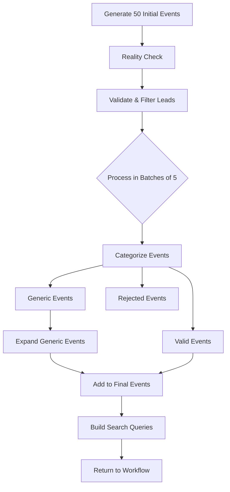

# Current Researcher Validation Logic Flow

**Date:** August 21, 2025  
**Purpose:** Document existing validation logic before extracting to Verifier agent

## Overview

The Researcher agent currently performs validation internally through the `_validate_and_filter_leads()` method, processing events in batches to categorize them as:
1. **Valid Events** - Ready for Fact-Checker
2. **Generic Events** - Need expansion
3. **Rejected Events** - Removed from pipeline

## Current Flow



## Detailed Validation Process

### 1. Input Processing (Lines 745-759)
- Receives initial events from generation step
- Processes in batches of 5 to avoid token limits
- Tracks generic events for later expansion

### 2. Validation Prompt Structure (Lines 760-789)

**Critical Context Provided:**
- Today's date
- Valid date range (calculated from time_frame)
- User interests

**Three Categories for Classification:**

#### Valid Events (Keep)
- Have specific dates within range
- Have specific venues and times
- Are discrete, photographable moments
- Can be verified with sources

#### Generic Events (Expand)
- Large umbrella events (e.g., "Fashion Week")
- General festivals without specific activities
- Note: Most events should be VALID, not generic

#### Rejected Events (Remove)
- Outside the date range
- Too vague to expand
- Don't align with user interests
- Can't be verified at all

### 3. LLM Validation Call (Lines 794-836)

**Schema Requirements:**
```json
{
  "validated_events": [...],
  "generic_events": [...],
  "removed_count": integer,
  "validation_notes": string
}
```

**Each Validated Event Must Have:**
- description
- type
- keywords
- date
- source_url
- time (optional)
- venue (optional)
- verification_note (optional)

### 4. Response Processing (Lines 838-865)

- Collects all responses across iterations
- Tracks costs and tokens
- Stops early if 15+ validated events found
- Accumulates generic events for expansion

### 5. Generic Event Expansion (Lines 877-891)

- Calls `_expand_generic_events()` for collected generic events
- Passes location and date range
- Adds expanded events to final list
- Updates cost tracking

### 6. Final Processing (Lines 893-896)

- Builds search queries for all final events
- Returns structured response with events, costs, and metrics

## Key Methods Involved

### Primary Validation Method
- `_validate_and_filter_leads()` - Main validation orchestrator

### Supporting Methods
- `_expand_generic_events()` - Expands generic to specific
- `_build_search_query()` - Creates Tavily search queries
- `_verify_event_reality()` - Earlier reality check (separate from validation)

## Data Structures

### Input Event Structure
```python
{
    "description": str,
    "type": str,
    "keywords": List[str],
    "confidence": str,  # optional
    "source_hint": str  # optional
}
```

### Output Event Structure
```python
{
    "description": str,
    "type": str,
    "keywords": List[str],
    "date": str,
    "time": str,  # optional
    "venue": str,  # optional
    "source_url": str,
    "verification_note": str,  # optional
    "search_query": str
}
```

## Metrics Tracked

- Total events validated
- Events removed
- Generic events found
- Expansion success rate
- LLM costs (tokens, time, dollars)

## Logic to Extract for Verifier

### What Moves to Verifier
1. **Specificity Check**: Lines 771-775 (Valid Events criteria)
2. **Temporality Check**: Lines 772 (date range validation)
3. **Categorization Logic**: Lines 769-788 (three categories)

### What Stays in Researcher
1. **Reality Check** (`_verify_event_reality()`)
2. **Generic Event Expansion** (`_expand_generic_events()`)
3. **Search Query Building** (`_build_search_query()`)
4. **Batch Processing Logic** (iteration management)

## Current Pain Points

1. **Monolithic Validation**: All validation in one large method
2. **Mixed Concerns**: Validation mixed with expansion and search prep
3. **Hard to Test**: Can't test validation independently
4. **No A/B Testing**: Can't compare different validation approaches

## Migration Strategy

1. Extract categorization logic to Verifier
2. Verifier returns simple pass/fail for each event
3. Researcher handles feedback and expansion
4. Maintain backward compatibility during transition