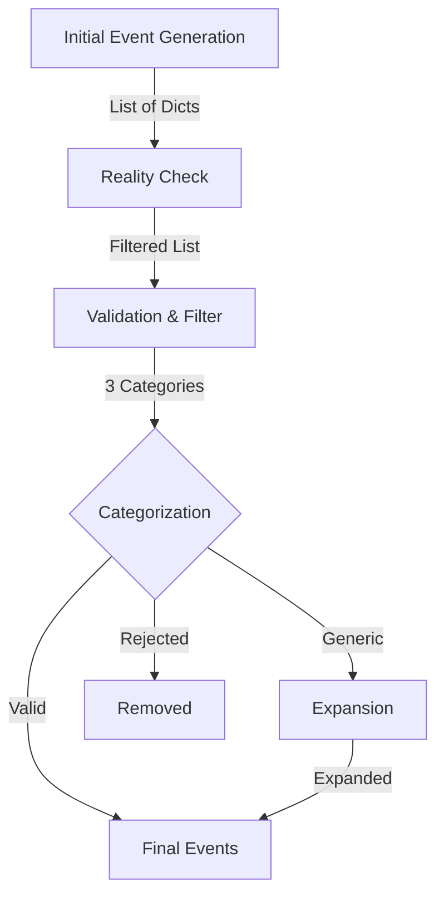

# Validation Data Structure Mapping

**Date:** August 21, 2025  
**Purpose:** Document data transformations in validation pipeline

## Data Flow Through Validation Pipeline



## Data Structure Transformations

### 1. Initial Generation Output
```python
# From _generate_initial_events()
{
    "description": "Climate March at Washington Square Park",
    "type": "protest",
    "keywords": ["climate", "march", "washington square"],
    "confidence": "high",          # Optional
    "source_hint": "recurring event"  # Optional
}
```

### 2. After Reality Check
```python
# From _verify_event_reality()
{
    "description": "Climate March at Washington Square Park",
    "type": "protest", 
    "keywords": ["climate", "march", "washington square"],
    "verification_status": "verified",  # Added
    "confidence_score": 85,            # Added
    "search_query": "Climate March Washington Square" # Optional
}
```

### 3. Validation Input (Current)
```python
# Into _validate_and_enhance_leads()
{
    "description": "Climate March at Washington Square Park",
    "type": "protest",
    "keywords": ["climate", "march", "washington square"],
    "verification_status": "verified",
    "confidence_score": 85
}
```

### 4. Validation Categories (Current)

#### Valid Events
```python
{
    "description": "Climate March at Washington Square Park",
    "type": "protest",
    "keywords": ["climate", "march", "washington square"],
    "date": "August 24, 2025",        # Required
    "time": "2:00 PM",                 # Optional
    "venue": "Washington Square Park", # Optional
    "source_url": "https://...",      # Required
    "verification_note": "Annual recurring event" # Optional
}
```

#### Generic Events
```python
{
    "description": "Fashion Week NYC",
    "type": "fashion",
    "keywords": ["fashion week", "NYC"],
    "reason_generic": "Needs specific shows/dates"
}
```

#### Rejected Events
```python
# Not returned, just counted as removed_count
```

### 5. After Expansion
```python
# From _expand_generic_events()
{
    "description": "Michael Kors Show at Spring Studios",
    "type": "fashion",
    "keywords": ["michael kors", "fashion week", "spring studios"],
    "date": "September 10, 2025",
    "time": "3:00 PM",
    "venue": "Spring Studios",
    "expanded_from": "Fashion Week NYC"  # Added for tracking
}
```

### 6. Final Output to Fact-Checker
```python
# After all processing
{
    "description": "Climate March at Washington Square Park",
    "type": "protest",
    "keywords": ["climate", "march", "washington square"],
    "date": "August 24, 2025",
    "time": "2:00 PM",
    "venue": "Washington Square Park",
    "source_url": "https://...",
    "search_query": "Climate March Washington Square August 24"  # Added
}
```

## New Verifier Data Flow

### Verifier Input (NEW)
```python
# From Researcher to Verifier
{
    "events_to_verify": [
        {
            "description": "Climate March at Washington Square Park on August 24",
            "type": "protest",
            "keywords": ["climate", "march"],
            # Note: No validation yet, just raw events
        }
    ]
}
```

### Verifier Output (NEW)
```python
# From Verifier back to state
{
    "verification_results": [
        {
            "event": {...},  # Original event
            "is_specific": True,
            "specificity_details": {
                "has_date": True,
                "has_location": True,
                "has_time": False
            },
            "temporality": "FUTURE",
            "confidence": 0.85,
            "should_keep": True
        }
    ],
    "verified_events": [...],  # Events that passed
    "rejected_events": [...],  # Events that failed
    "needs_more_events": False  # If <15 passed
}
```

### Researcher Adaptation (NEW)
```python
# Researcher processes Verifier feedback
if state.get("verification_results"):
    # Separate passed/failed
    for result in verification_results:
        if result["should_keep"]:
            # Add to confirmed leads
            confirmed_leads.append(result["event"])
        else:
            # Attempt to refine or replace
            if result["temporality"] == "PAST":
                # Generate future version
            elif not result["is_specific"]:
                # Add more specificity
```

## Key Transformations

### Current (Monolithic in Researcher)
1. Generate → Reality Check → Validate → Expand → Search Prep

### New (With Verifier)
1. Generate → Reality Check → **Send to Verifier**
2. **Receive from Verifier** → Refine/Expand → Search Prep

## Fields Added at Each Stage

| Stage | Fields Added |
|-------|--------------|
| Generation | description, type, keywords |
| Reality Check | verification_status, confidence_score |
| Validation (Current) | date, time, venue, source_url |
| Verifier (New) | is_specific, temporality, should_keep |
| Expansion | expanded_from |
| Search Prep | search_query |

## Critical Data Requirements

### For Verifier to Function
- **Input**: description (minimum)
- **Output**: is_specific, temporality, should_keep

### For Fact-Checker to Function
- **Required**: description, search_query
- **Optional**: date, venue, keywords

### For Publisher to Function
- **Required**: Evidence from Fact-Checker
- **Uses**: All available fields for extraction